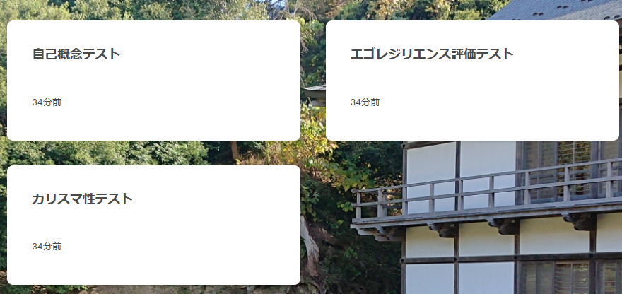
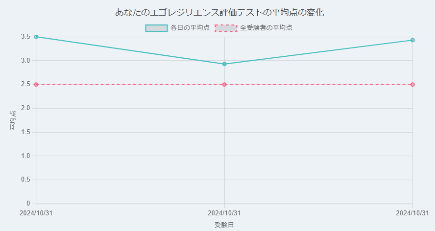
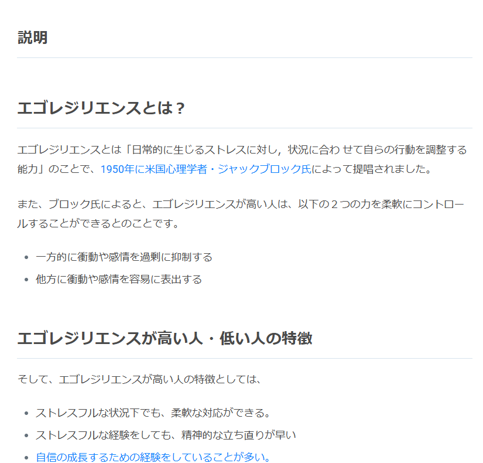
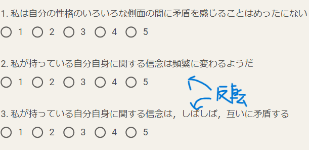
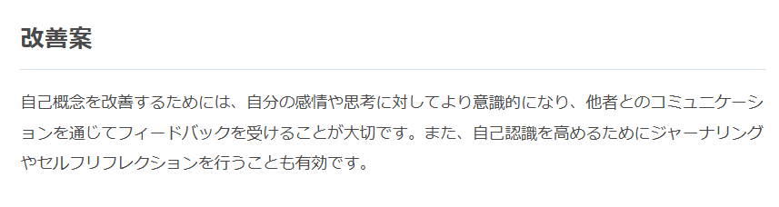
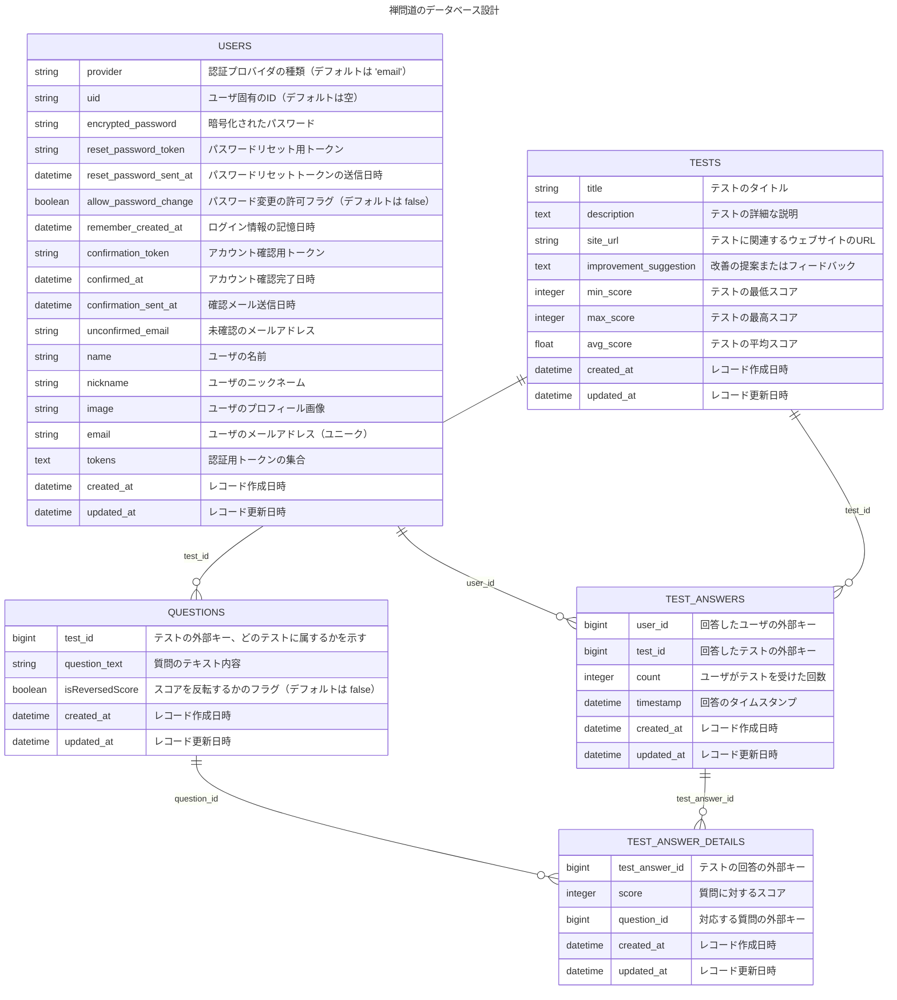

# 禅問道

心理学や医療健康の研究で使われているテストに回答できるアプリです。

<video src="zenn-mondo.mp4" controls="true"></video>

## 作り始めたきっかけ

もともと、心理学や健康科学に興味があり、[論文を読んで記事にまとめたり](https://mametaro99.github.io/)、研究で使われているテストに回答したりしていました。また、自分自身で掲載されているテストを受けていく中で、以下のような課題を感じました。

- 掲載されているテストの点数をメモしたり、計算したりするのが面倒
- 過去にテストを受けたときの記録が残っていないため、自分の進歩が分からない。

上記のような課題感を感じるとともに、少しでも最新の科学を発信し、個人の生活に役立ててもらおうと考え、このアプリを作成しました。

## アプリの概要

このアプリでは、以下のように心理学や健康科学に関わるいくつかのテストを受けることができます。

そして、テストを受験すると、結果をグラフで見ることができます。受験者の平均点やテスト結果の推移を見ることができ、過去の結果や平均的な値と比較して、自分の状態を知ることができます。

また、各テストで測られる指標についての説明や、その指標がもたらす生活への影響や、その指標の改善点を論文を元に紹介しています。

## アプリの技術スタック

### バックエンド
Ruby(3.1.2)
RailsAPI(7.0.4)

#### 主なGem

- Devise
- bullet
- kaminari
- Rspec
- FactoryBot
- rubocop

### フロントエンド
Typescript(5.3.3)

React(18.3.1)

Next.js(15.0.1) PageRouter

#### 主なライブラリ

- Material-UI(5.14.7)
- ESlint(8.48.0)
- pretter(3.0.3)
- chart.js(グラフ描画)
- marked（マークダウン表示用）

### データベース
MySQL(8.0.32)

### CI・CD
GithubActions

### ソースコード管理
Github

### インフラ
開発環境：
- Docker(24.0.5)
- Ubuntu(22.04.3 LTS)

本番環境：
- AWS（ECS,ECR,VPC,ALB,IAM等）
- zeroSSL(SSL証明書発行)
- ドメイン取得（お名前ドットコム）
- Gmail SMTP(メール送信)

### その他開発ツール

- GoogleChrome
- Talend API Tester(API動作確認)
- Chrome検証機能(フロントエンド動作確認)
- VisualStudioCode

## 開発した機能一覧

- サインイン・サインアウト機能
- サインアップ機能
- ユーザのメール認証機能
- テストの一覧・詳細表示
- テストの受験フォーム
- ユーザのテスト結果のグラフ作成

## 工夫したところ　【バックエンド】

### CROD設計

RailsControllerで定義するメソッドを、[CROD設計](https://zenn.dev/code_journey_ys/articles/702a2f1d4b97da)に基づいて、以下のもののみに限定しました。

- new
- create
- index
- show
- edit
- update
- delete

上記のように、CRUD設計に従うことで、コントローラに書くメソッドを統一して、コードの可読性を上げるようにしました。

また、フロントエンド側からしても、エンドポイントやメソッドが分かりやすいように設計しました。

### スコアを反転できる質問を追加できるようにして、テスト結果を適切に評価できるようにした。

[心理学などで使われる選択式アンケートでは、問われている質問に対して、
すべての回答に最大点を選択する等、被験者にバイアスがかかってしまう場合があります。](https://archives.bukkyo-u.ac.jp/rp-contents/KO/0031/KO00310L015.pdf)

そこで、[逆転項目](https://kotodori.jp/user-research/survey/questionnaire-reversal-item/#:~:text=%E3%81%8C%E3%81%A7%E3%81%8D%E3%81%BE%E3%81%99%E3%80%82-,%E9%80%86%E8%BB%A2%E9%A0%85%E7%9B%AE%E3%81%AE%E3%83%A1%E3%83%AA%E3%83%83%E3%83%88,%E3%82%92%E6%95%A3%E3%82%89%E3%81%97%E3%81%9F%E3%82%8A%E3%81%97%E3%81%BE%E3%81%99%E3%80%82)という選んだ選択肢の結果を反転する質問項目を追加することで被験者が適切な評価を行えるようにすることがあります。

このアプリにおいても、逆転項目を各テストに反映するために、
各質問について変数isRevercedScoreを使って点数を反転する質問かどうかを判断できるようにしました。

そして、ユーザがテストの各質問に回答した時に、
質問のisReversedScoreがtrueの場合に、点数を反転させるように実装しました。

## 工夫したところ　【フロントエンド】

### 結果をグラフ化して、直感的にテストの結果が分かるようにした。

フロントエンドでは、chart.jsを使って、テストの結果を

- 縦軸:点数
- 横軸:期間

の折れ線グラフで表示しました。

このグラフを表示することによって、ユーザの期間ごとのテスト結果の違いが分かります。

また、実際の研究で使われている平均点も表示することで、自分のテストで測る指標を客観的なデータと比較して、理解することができます。

### 研究論文を紹介して、テストで測った指標のメリット・デメリットや改善案を提示

テスト結果のグラフの下部に研究についての説明やテストで測った指標の改善案を紹介する文を記載しました。

テストの結果の下に研究内容や改善案を提示することで、
ユーザが自分が得たテストの数値的な結果に加えて、さらにその結果のメリットやデメリットやテストで測った指標を改善するための具体的な方法を知ることができます。

改善案例（自己概念）

## データベース設計

以下は、このアプリのデータベース設計となっています。

## インフラ設計図

